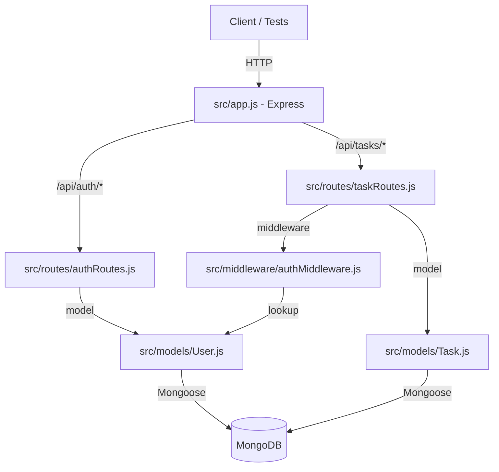

# Task Manager REST API — Implementation Plan

## Current State

The project has a complete skeleton with all files scaffolded but **no business logic implemented**. Every handler and schema is stubbed with comments describing what to build. The dependencies are already declared in `package.json`.

### Files that need implementation:

| File                               | Current State     | What's needed                                              |
| ---------------------------------- | ----------------- | ---------------------------------------------------------- |
| `src/models/User.js`               | Empty schema `{}` | Add name, email, password, createdAt fields                |
| `src/models/Task.js`               | Empty schema `{}` | Add title, description, completed, owner, createdAt fields |
| `src/middleware/authMiddleware.js` | Empty function    | JWT verification, user lookup, attach to `req.user`        |
| `src/routes/authRoutes.js`         | Empty handlers    | Register and login logic                                   |
| `src/routes/taskRoutes.js`         | Empty handlers    | CRUD task logic with ownership checks                      |

### Files that are complete:

- `server.js` — entry point, connects DB, starts server
- `src/app.js` — Express app with routes mounted
- `src/config/db.js` — Mongoose connection helper
- `package.json` — all dependencies declared
- `tests/` — test files are pre-written

---

## Architecture



---

## Implementation Details

### 1. User Model — `src/models/User.js`

Define the Mongoose schema with these fields:

- `name`: String, required
- `email`: String, required, unique
- `password`: String, required, minlength 6
- `createdAt`: Date, default `Date.now`

No pre-save hook for password hashing — hashing will be done in the register route handler to keep things explicit.

### 2. Task Model — `src/models/Task.js`

Define the Mongoose schema with these fields:

- `title`: String, required
- `description`: String (optional)
- `completed`: Boolean, default false
- `owner`: ObjectId, ref "User", required
- `createdAt`: Date, default `Date.now`

### 3. Auth Middleware — `src/middleware/authMiddleware.js`

Logic:

1. Extract `Authorization` header
2. Parse the `Bearer <token>` format
3. Verify token using `jwt.verify()` with `process.env.JWT_SECRET`
4. Find the user by decoded `id` using `User.findById()`
5. Attach user to `req.user`
6. Call `next()`
7. On any failure, return `401` with error message

### 4. Register Route — `POST /api/auth/register`

Logic:

1. Extract `name`, `email`, `password` from `req.body`
2. Check if user with that email already exists → 400 error
3. Hash password with `bcrypt.hash()` (salt rounds: 10)
4. Create and save new User
5. Return 201 with user object (excluding password)

### 5. Login Route — `POST /api/auth/login`

Logic:

1. Extract `email`, `password` from `req.body`
2. Find user by email → 400/401 if not found
3. Compare password with `bcrypt.compare()`
4. Generate JWT with `jwt.sign()` containing user `id`
5. Return 200 with `{ token }`

### 6. Create Task — `POST /api/tasks`

Logic:

1. Extract `title`, `description` from `req.body`
2. Create task with `owner: req.user._id`
3. Save and return 201 with the task

### 7. Get Tasks — `GET /api/tasks`

Logic:

1. Find all tasks where `owner === req.user._id`
2. Return 200 with array of tasks

### 8. Delete Task — `DELETE /api/tasks/:id`

Logic:

1. Find task by `req.params.id`
2. If not found → 404
3. If `task.owner` !== `req.user._id` → 401/403
4. Delete the task
5. Return 200 with success message

### 9. Test Infrastructure

The tests import `app` from `src/app.js`, which does NOT call `connectDB()`. We need to:

- Add a jest setup file that connects to MongoDB before all tests
- Add a jest teardown that disconnects and cleans up after tests
- Update `jest.config.js` to reference the setup/teardown
- Use either a local MongoDB or `mongodb-memory-server` for isolation

**Option A — Local MongoDB**: Use the URI from `.env.test` (`mongodb://localhost:27017/taskmanager_test`). Requires a running MongoDB instance.

**Option B — mongodb-memory-server**: Install as a dev dependency for a self-contained in-memory MongoDB. More portable, no external dependency.

**Recommendation**: Option B (`mongodb-memory-server`) is more reliable for CI/CD and local dev. We should install it and configure the jest setup accordingly.

### 10. Environment File

Create `.env` from `.env.example`:

```env
PORT=5000
MONGO_URI=mongodb://localhost:27017/taskmanager
JWT_SECRET=supersecretkey123
```

---

## Execution Order

1. Install dependencies (`npm install` + add `mongodb-memory-server`)
2. Implement User model
3. Implement Task model
4. Implement auth middleware
5. Implement register route
6. Implement login route
7. Implement task routes (create, get, delete)
8. Configure jest test setup with MongoDB connection
9. Create `.env` file
10. Run tests and verify all pass
